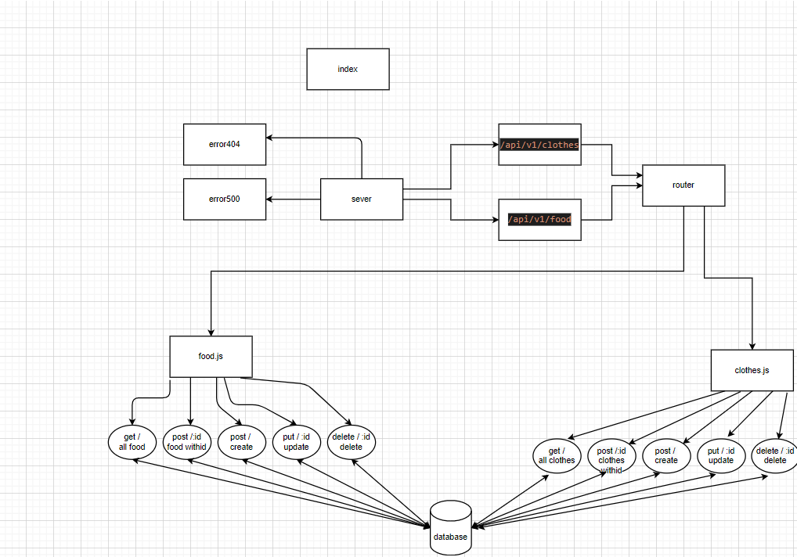

# basic-api-server


## About 
 A REST Express API, has various endpoints that perform CRUD operations on a Mongo Database, using the REST standards . 
 It has two data models and two routers : clothes and food . 
<hr>

## Author
 Ahmad Arman
<hr>

## Links
* [REPOSITORY](https://github.com/ahmad-arman/basic-api-server)
 * [Heroku](https://ahmad-arman-basic-api-server.herokuapp.com/)
 * [PULL REQUEST](https://github.com/ahmad-arman/basic-api-server/pull/3)
<hr>

## Setup
1. `(.env)` file 
```
PORT = 3000
MONGOOSE_URI = mongodb://localhost:27017/people

 MONGOOSE_TEST_URI = mongodb://localhost:27017/testing
```
2. Install the following dependencies
```
npm init -y 
npm i cors dotenv express morgan mongoose
npm i -D jest supertest
npm i @code-fellows/supergoose 
mongod --dbpath=/Users/path/to/data/db
```
## Running the app 
1. clone the repo.
2. Enter the command `npm start`
3. Use endpoints :
   ## Food
  ### * `/api/v1/food`
<br>

- **Method** : GET 
- **CRUD Operation** : Read / Gets All Food Records
- **Response Body**   : JSON
```
[
    {
        "_id": "60a59fe36c328241b96f7237",
        "name": "burger",
        "role": "meat",
        "__v": 0
    },
    {
        "_id": "60a5a0156c328241b96f7238",
        "name": "pizza",
        "role": "chicken",
        "__v": 0
    }
]
```
<br>


- **Method** : POST 
- **CRUD Operation** : Create / Add a Record
- **Response Body**   : JSON
```
    {
        "_id": "60a5938ee109aa218e6f5a6f",
        "name": "pizza",
        "type": "chicken",
        "__v": 0
    }
```
<br>

 ### * `/api/v1/food/id`
<br>

- **Method** : GET 
- **CRUD Operation** : Read / Get One Record
- **Response Body**   : JSON
```
    {
        "_id": "60a5938ee109aa218e6f5a6f",
        "name": "pizza",
        "type": "chicken",
        "__v": 0
    }
```
<br>

- **Method** : PUT 
- **CRUD Operation** : UPDATE / Update a Record
- **Response Body**   : JSON
```
    {
        "_id": "60a5938ee109aa218e6f5a6f",
        "name": "pizza",
        "type": "chicken",
        "__v": 0
    }
``` 
<br>

- **Method** : DELETE 
- **CRUD Operation** : DELETE / Delete a Record
- **Response Body**   : JSON
```
    {
        "_id": "60a5938ee109aa218e6f5a6f",
        "name": "pizza",
        "type": "chicken",
        "__v": 0
    }
```
<br><br><br>
<hr>
<br><br>

  ## Clothes
  ### * `/api/v1/clothes`
<br>

- **Method** : GET 
- **CRUD Operation** : Read / Gets All clothes Records
- **Response Body**  : JSON
```
[
    {
        "_id": "60a5938ee109aa218e6f5a6f",
        "name": "jacket",
        "type": "kids",
        "__v": 0
    },
    {
        "_id": "60a5945ce109aa218e6f5a70",
        "name": "jacket",
        "type": "man",
        "__v": 0
    }
]
```
<br>

- **Method** : POST 
- **CRUD Operation** : Create / Add a Record
- **Response Body**   : JSON
```
{
    "name":"jacket",
    "type":"man"
}
```
<br>

 ### * `/api/v1/clothes/id`
<br>
- **Method** : GET 
- **CRUD Operation** : Read / Get One Record
- **Response Body** : JSON
```
 {
        "_id": "60a5938ee109aa218e6f5a6f",
        "name": "jacket",
        "type": "man",
        "__v": 0
    }
```
<br>

- **Method** : PUT 
- **CRUD Operation** : UPDATE / Update a Record
- **Response Body**  : JSON
```
 {
        "_id": "60a5938ee109aa218e6f5a6f",
        "name": "jacket",
        "type": "mannn",
        "__v": 0
    }
```
<br>

- **Method** : DELETE 
- **CRUD Operation** : DELETE / Delete a Record
- **Response Body**   : JSON
```
 {
     "_id": "60a5938ee109aa218e6f5a6f",
     "name": "jacket",
     "type": "mannn",
      "__v": 0
    }
```
4. Test . 
* There's 2 test files . logger.test.js and server.test.js
* In terminal run :
```
npm test
```
<br><br><br>
<hr>
<br><br>

## UML Diagram
